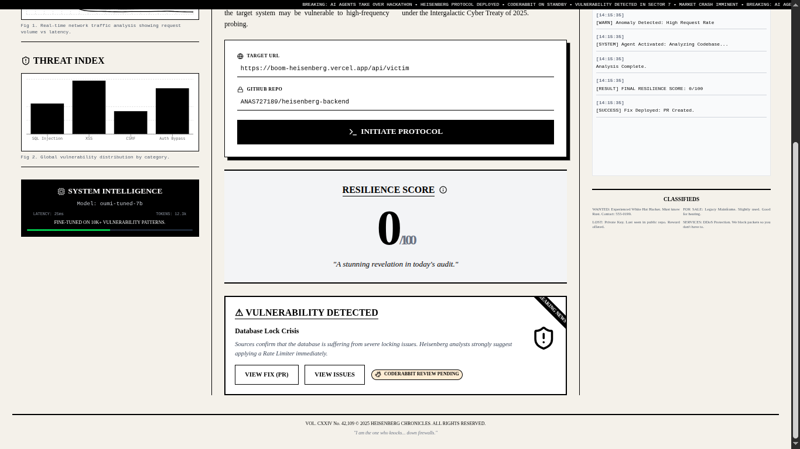
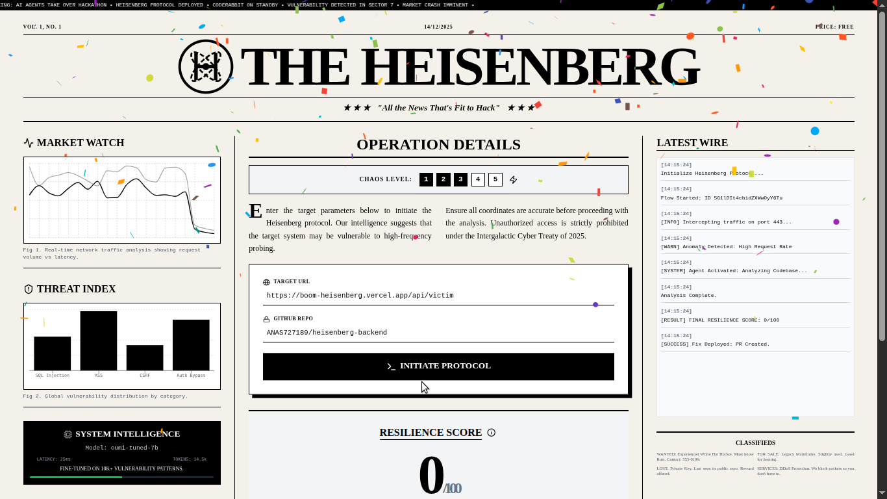
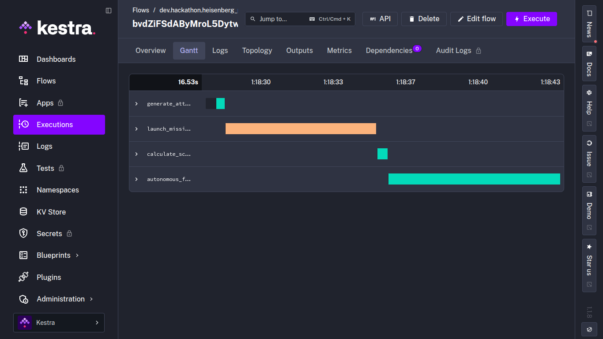

# Heisenberg Protocol

> **The Autonomous Cyber-Resilience & Self-Healing System**

**Heisenberg Protocol** is an advanced security orchestration platform designed to autonomously **detect**, **analyze**, and **remediate** infrastructure vulnerabilities in real-time. By combining chaos engineering with automated remediation workflows, it ensures systems remain resilient against high-velocity threats.

---

## Table of Contents

- [System Overview](#system-overview)
- [Key Features](#key-features)
- [Architecture](#architecture)
- [Usage Guide](#usage-guide)
- [License](#license)

---

## System Overview

Heisenberg operates as a closed-loop security agent. It proactively stress-tests target endpoints, analyzes performance degradation, and autonomously deploys code fixes via GitHub Pull Requests without human intervention.

The platform features a high-fidelity "Command Center" dashboard that provides real-time visibility into network traffic, threat vectors, and remediation status.

## Key Features

### 1. Autonomous Chaos Injection

- **Engine:** Powered by **Grafana k6** running in isolated Docker containers.
- **Operation:** Simulates high-concurrency DDoS and stress attacks to identify system breaking points.
- **Metrics:** Captures latency, error rates, and throughput in real-time.

### 2. Self-Healing Infrastructure

- **Detection:** Automatically identifies specific failure modes (e.g., Database Locking, 500 Errors).
- **Remediation:** The **Autonomous Fix Agent** generates specific patches (e.g., Rate Limiting Middleware).
- **Deployment:** Automatically creates a Git branch, commits the fix, and opens a detailed Pull Request linked to the vulnerability report.

### 3. Real-Time Command Center

- **Visuals:** A distinct, high-contrast "Newspaper" aesthetic for maximum readability and urgency.
- **Analytics:** Live `Recharts` visualization of network traffic and threat distribution.
- **Live Wire:** Real-time terminal logs streaming directly from the orchestration backend.
- **Alerts:** "Breaking News" marquee system for critical vulnerability announcements.

### 4. AI & Development

- **AI Engine:** **Oumi SDK** (Python) running `oumi-tuned-7b`.
- **Agent Protocol:** Custom implementation of the **Cline (Claude Dev) Protocol**.
  - Uses XML-based reasoning (`<thought>`, `<plan>`, `<attempt_completion>`) to ensure high-quality, secure code generation.
  - Implements a "Hybrid Mode" that seamlessly switches between GPU-accelerated inference and heuristic fallbacks for demo reliability.
- **Training Data:** Vulnerability datasets structured for Oumi fine-tuning.
- **Orchestration:** **Kestra** manages the "Attack-Detect-Fix" loop.

---

## Architecture

The system is built on a modern, decoupled architecture ensuring scalability and isolation:

1.  **Frontend (Control Plane):**
    - Built with **Next.js 15** and **Tailwind CSS**.
    - Handles user interaction, visualization, and real-time polling.
2.  **Orchestration Layer:**
    - **Kestra** workflow engine manages the lifecycle of attacks and fixes.
    - Executes Python scripts for logic and GitHub API interactions.

3.  **Execution Plane:**
    - Dockerized runners execute `k6` load tests.
    - Isolated environments ensure safety during chaos experiments.

---

## Usage Guide

1.  **Access the Dashboard:** Navigate to the main interface.
2.  **Configure Target:** Enter the Target URL and the GitHub Repository to monitor.
3.  **Initiate Protocol:** Click **"INITIATE PROTOCOL"** to begin the chaos test.
4.  **Monitor:** Watch the "Latest Wire" for logs and the "Market Watch" for traffic spikes.
5.  **Remediation:** If a vulnerability is detected (Score < 50), the system will automatically:
    - Issue a "Breaking News" alert.
    - Create a GitHub Issue.
    - Generate and Commit a Fix.
    - Open a Pull Request.
6.  **Verification:** Click the generated links to review the autonomous code fix.

---

## License

This project is licensed under the MIT License - see the [LICENSE](LICENSE) file for details.

&copy; 2025 Heisenberg Protocol. All systems operational.
